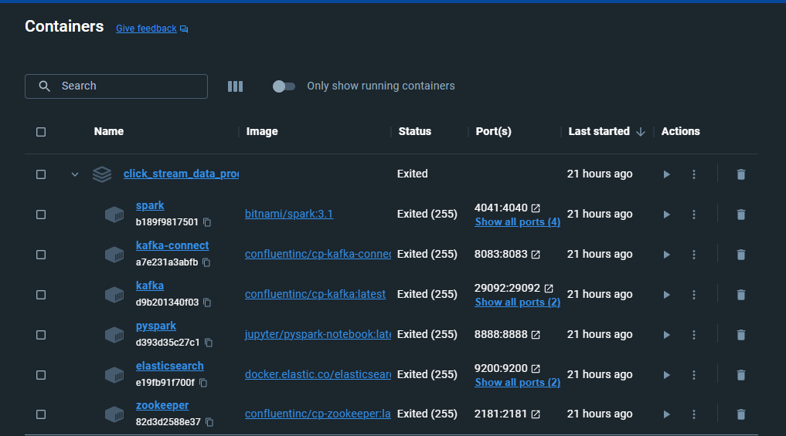
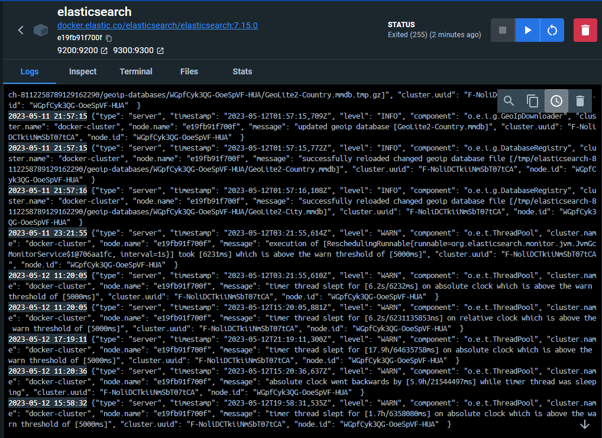

# Data Engineering Assignment 

## Introduction 

This repository contains the code for the data engineering assignment. The assignment is to create a data pipeline that extracts data from a source.

1. Ingest clickstream data from Kafka.
2. Store the ingested data in datastore, with the schema:

RowKey: <timestamp>_<userid>_<url> 
ColumnFamily: 
    Click_data: 
        Userid: <userid> 
        Timestamp: <timestamp>
        URL: <url>
    geo_data:
        Country: <country>
        City: <city>

3. Index the processed data in Elasticsearch. 

## Architecture 

The architecture of the data pipeline is as follows: 

```
datasource -> Kafka -> Spark Streaming -> Elasticsearch
```

Dataset is from the kaggle repo [https://www.kaggle.com/datasets/tunguz/clickstream-data-for-online-shopping](https://www.kaggle.com/datasets/tunguz/clickstream-data-for-online-shopping) .

Checkout the [notebook](pyspark-notebooks\Dataprocessing.ipynb) where the processing is done. But We can split the function and try to perform data orchestration using airflow. (inprogress)

## Setup 
Docker file containing services for Kafka, Spark, Elasticsearch are provided 

# Images: 
    
    
## InProgress 

1. integrating airflow to the pipeline checkit out at [airflow_branch](https://github.com/seepala98/ViralNation_Assessment.git)
2. The schema isnt perticularly followed as the data set doesnt contain most of the requirements specified.
3. The data set is not complete just processing the data directly from kafka to elastic search. 

## Improvements: 
1. Include the use of hbase or cassandra for storing the data. 
2. schedule jobs to run in timely manner using airflow. 
